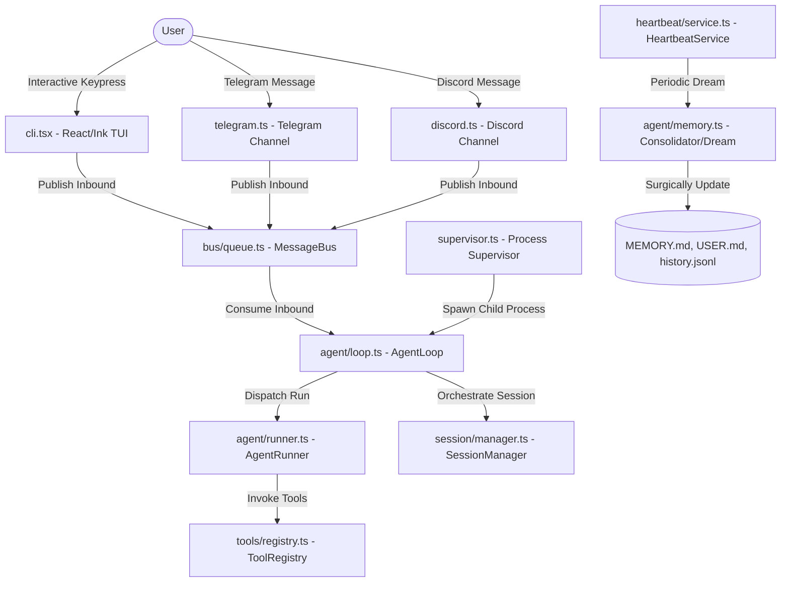
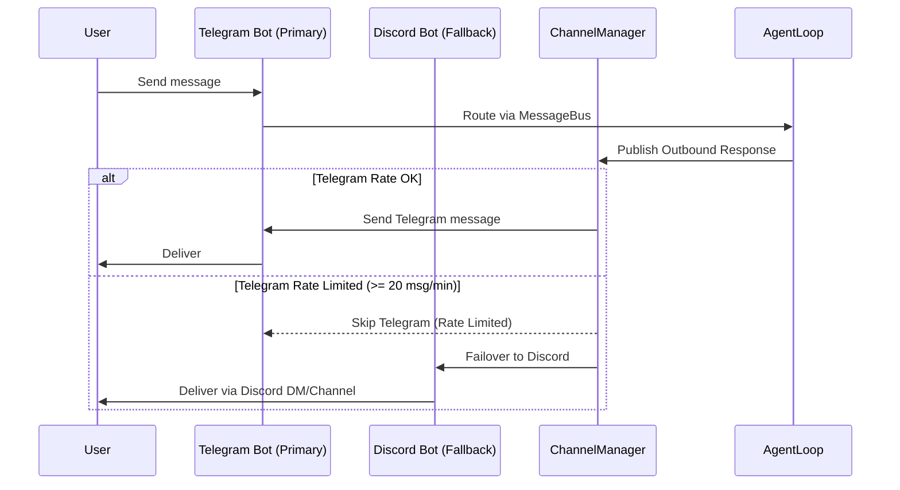
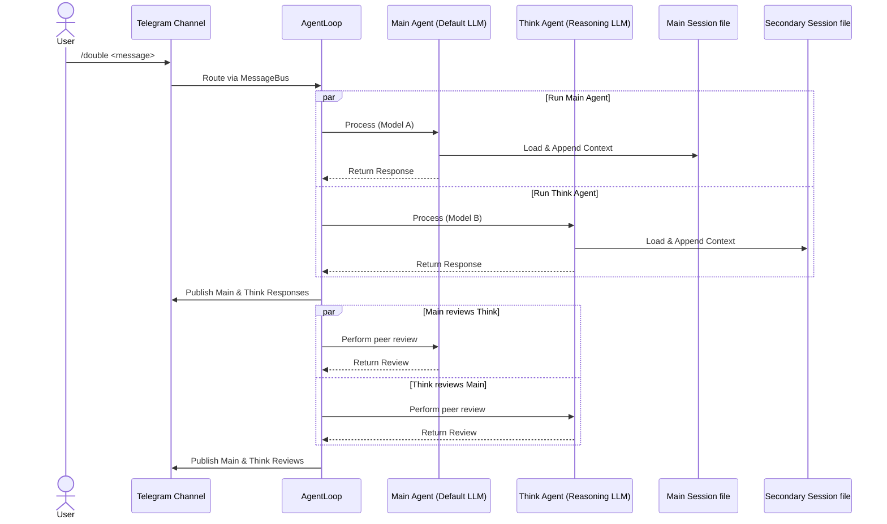

# reese 🤖

A highly sophisticated, local-first personal AI agent designed to run seamlessly on your machine. Chat natively inside a premium interactive terminal UI (TUI) or connect remotely via a dual-channel (Telegram + Discord fallback) messaging gateway. 

Reese operates with a **zero-database design system** — your conversation history, personal preferences, and long-term memory are stored entirely in plain, human-readable markdown files.

```bash
reese              # Launch the premium React/Ink Terminal UI
reese gateway      # Start the Telegram + Discord Fallback Gateway
reese supervisor   # Start the process supervisor (Gateway lifecycle + Remote operations)
```

---

## ⚡ Core Features

- **📺 Immersive Terminal UI (TUI):** A full-screen, highly responsive CLI chat interface powered by React & Ink, featuring smooth streaming and live-updating activity spinners.
- **🛡️ High-Availability Gateway:** Decoupled, multi-channel messaging platform integrating **Telegram** and **Discord** with transparent rate-limit failovers.
- **🧠 Zero-Database Memory Engine:** Persistent long-term memory using markdown files (`USER.md`, `MEMORY.md`). Background "dreaming" surgically updates and consolidates memories without heavy db infrastructure.
- **👥 Double Agent Peer-Review:** Run multiple agents in parallel (e.g., standard model alongside advanced reasoning models like o1 or Claude Sonnet) with cross-review evaluations and independent conversation histories.
- **🔌 Extensible Custom Skills:** Load contextually aware capabilities using simple markdown files (`SKILL.md`) structured with YAML frontmatter.
- **🎛️ Supervisor Control Daemon:** Launch Reese as a systemd service managed by an intelligent supervisor. Control process status, trigger git updates, check health, or run remote shell commands directly via Discord.

---

## 📐 System Architecture

Reese is built around a highly decoupled, asynchronous, event-driven pattern. The following diagram illustrates the flow of messages, core execution, memory consolidation, and supervisor orchestration:



---

## 🔬 Infrastructure & Design Deep Dives

### 1. Decoupled Event-Driven Messaging
Reese uses an asynchronous, publisher-subscriber model managed by the `MessageBus` (located in `src/bus/queue.ts`). 
- **Decoupled Channels:** The input channels (TUI, Telegram, Discord) are completely unaware of the AI agent's internal state or execution loop. They simply publish `InboundMessage` events.
- **Thread-safe Dispatch:** The `AgentLoop` listens to the bus, serializing dispatches per conversation thread using sliding-promise session locks. This prevents concurrency conflicts when processing rapid-fire incoming messages.
- **Mid-Turn Streaming:** The agent can publish `OutboundMessage` updates, mid-turn status updates, and trigger parallel subagents asynchronously while the main reasoning thread is still active.

### 2. High-Availability Gateway Failover
When running in `gateway` mode, Reese runs both a Telegram long-polling listener and a Discord listener concurrently. To counter severe API rate limits, the `ChannelManager` tracks outgoing traffic patterns:


- **Transparent Fallback:** If Telegram triggers rate-limiting (monitored via a sliding-window message limit of 20 msg/min), the manager instantly routes the agent's output to Discord without interrupting the discussion context.
- **No Message Loss:** The outbound events remain queued in the `MessageBus` until channel capacity recovers, maintaining perfect reliability.

### 3. Lifecycle Supervisor & Control Daemon
The `reese supervisor` is a high-availability process runner configured to secure and run the gateway process under a robust management layer.
- **Subprocess Isolation:** The supervisor spawns the gateway as a child process, captures crashes, sends instant error notifications via Telegram/Discord, and handles automatic warm restarts.
- **Remote Operations:** Administrators can interact with the supervisor's command menu directly using Discord Slash Commands:
  - `/status` / `/start` / `/stop` / `/restart`: Full operational lifecycle control over the bot process.
  - `/upgrade`: Auto-triggers a git repository update (`git pull`), installs new dependencies, and performs a hot reboot of the gateway process.
  - `/shell <cmd>`: Executes secure remote shells from the repository root.
  - `/apm <prompt>`: Remote diagnostic prompt evaluator running with full administrative execution flags (`--dangerously-allow-all`).

### 4. Surgical Markdown Memory Engine
Rather than relying on structured relational databases or vector indices that demand separate storage services, Reese relies on a lightweight local filesystem model:
- **Raw History:** Conversation archives are appended line-by-line as raw events to `history.jsonl`.
- **The Dream Cycle:** Every 2 hours (customizable), the `HeartbeatService` triggers the two-phase `Dream` process:
  1. **Consolidator Phase:** Instructs the LLM to inspect the incremental `history.jsonl` lines since the last consolidation event.
  2. **Surgical Update Phase:** Performs modular modifications directly on `USER.md` (what Reese understands about the owner's details, preferences, and profile) and `MEMORY.md` (long-term factual archives).
- **Instant Hot-Reload:** Because memory resides entirely in flat markdown, you can open and edit `USER.md` or `MEMORY.md` inside any text editor. Reese hot-reloads these details instantly upon receiving the next message.

### 5. Dual-Agent Peer Review (`/double`)
Reese features a `/double` multi-agent protocol to handle high-stakes reasoning problems by spawning dual parallel agents:


- **Parallel Processing:** Both the Main Agent and the advanced Think Agent run asynchronously in parallel, avoiding model processing blockages.
- **Session Segmentation:** The primary chat history maintains the standard session (`telegram_{chatId}.json`), while the secondary reasoning model uses a distinct history buffer (`telegram_{chatId}_secondary.json`).
- **Mutual Cross-Review:** After both models formulate responses, the agents exchange their answers and critique one another. This peer-review loop highlights errors, clarifies contradictions, and exposes deeper insights.

---

## 📂 Project Structure

```
.
├── app/                      # Web and front-end layouts (if configured)
├── docs/                     # Architectural specs and secondary documentation
│   └── ARCHITECTURE.md       # Failover and rate-limiting designs
├── skills/                   # Out-of-the-box system skill configurations
│   ├── calendar/             # Schedule manager skill
│   ├── summarize/            # Conversation summary skill
│   └── systematic-debugging/ # Complex debugging guidelines
├── src/                      # Core TypeScript source code
│   ├── index.ts              # System entry point (boots TUI, Gateway, or Supervisor)
│   ├── cli.tsx               # Full-featured terminal chat UI drawn in React/Ink
│   ├── supervisor.ts         # Daemon manager, Discord CLI hooks, and lifecycle controls
│   ├── logger.ts             # Event logging framework (writes to file and forwards logs to Telegram)
│   ├── agent/                # The brain of the application
│   │   ├── loop.ts           # Unified chat event dispatcher & slash command parser
│   │   ├── runner.ts         # Agent execution engine & recursive tool loop handler
│   │   ├── context.ts        # Assembly engine for system instructions and workspace prompts
│   │   ├── memory.ts         # Consolidator & Dream tasks for local Markdown files
│   │   ├── skills.ts         # YAML parser and Loader for custom SKILL.md resources
│   │   └── hook.ts           # Standard interface hook managing stream filtering
│   ├── bus/                  # Decoupled messaging architecture
│   │   ├── queue.ts          # Core asynchronous pub/sub FIFO message queue
│   │   └── events.ts         # Event blueprints & channel tracking models
│   ├── channels/             # Remote communication modules
│   │   ├── base.ts           # General messaging channel blueprints
│   │   ├── manager.ts        # Message router enforcing sliding-window rate tracking
│   │   ├── telegram.ts       # Telegram GramMy bot client
│   │   └── discord.ts        # Discord.js bot client
│   ├── config/               # Settings & Validation systems
│   │   ├── paths.ts          # Auto-generator for local workspace directory structures
│   │   └── schema.ts         # Zod configuration validator enforcing .env schema
│   ├── heartbeat/            # Background schedule runners
│   │   └── service.ts        # Periodic timer manager (executes dreaming and heartbeats)
│   ├── providers/            # LLM API Connectors
│   │   ├── base.ts           # Standard LLM connector blueprint
│   │   └── openai_compat.ts  # Generic OpenAI-compatible client endpoint handler
│   ├── session/              # User state trackers
│   │   └── manager.ts        # Session loading, serialization, and subagent state persistence
│   └── tools/                # Extensible tooling catalog
│       ├── base.ts           # Abstract base tool class
│       ├── filesystem.ts     # I/O operations (read_file, write_file, edit_file, list_dir)
│       ├── shell.ts          # Terminal executor command runner (exec)
│       ├── search.ts         # Codebase indexers (grep, glob)
│       ├── web.ts            # Online connectivity utilities (web_fetch, web_search)
│       ├── message.ts        # Turn-based status messaging emitter
│       └── spawn.ts          # Background subprocess task runner
├── package.json              # Main Node project setup configuration
└── tsconfig.json             # TypeScript compiler settings
```

---

## ⚙️ Installation & Setup

### Requirements
- **Bun** ≥ 1.0 (Required)

```bash
# Clone the repository
git clone https://github.com/ytop/reese.git
cd reese

# Install TypeScript and Bun dependencies
bun install
```

### Install Global Command
Install `reese` to your path globally so you can launch it from any directory:
```bash
bun link
```

Or add a fast startup alias directly into your shell profile (`~/.zshrc` / `~/.bashrc`):
```bash
alias reese='bun run --cwd /path/to/reese src/index.ts'
```

---

## 📝 Configuration Settings

Copy the boilerplate environment variable schema:
```bash
cp .env.example .env
```

Open `.env` and fill in your model keys and channel tokens:
```env
# ==============================================================================
# 🤖 Primary Model (OpenAI-compatible endpoints supported)
# ==============================================================================
MODEL_API_KEY=sk-...
MODEL_API_BASE=https://api.openai.com/v1
MODEL_NAME=gpt-4o

# ==============================================================================
# 🧠 Think Model (Optional - Used for /think and /double agents)
# ==============================================================================
THINK_MODEL_API_KEY=sk-...
THINK_MODEL_API_BASE=https://api.openai.com/v1
THINK_MODEL_NAME=o1-preview

# ==============================================================================
# 💬 Channels Setup (Telegram Bot & Discord Fallback)
# ==============================================================================
# Primary Telegram Token
TELEGRAM_BOT_TOKEN=
# Restrict agent interaction to specific handles or user IDs (comma-separated)
TELEGRAM_ALLOW_FROM=your_telegram_username,123456789
# Bot forwards system alerts and logs to this Telegram chat ID
TELEGRAM_LOG_CHAT_ID=

# Secondary Discord Token
DISCORD_BOT_TOKEN=
# Restrict interaction to specific Discord user IDs or '*' to open access
DISCORD_ALLOW_FROM=your_discord_id,*
# Dedicated Discord channel for supervisor system logs
DISCORD_LOG_CHANNEL_ID=

# ==============================================================================
# 📂 Local Storage Workspace Directories
# ==============================================================================
# Memory files, custom skills, active sessions, and logs go here
# Defaults to $HOME/.reese/workspace
# WORKSPACE_DIR=
```

---

## 🚀 Running Reese

### 1. Terminal UI (TUI) Mode
Run the interactive full-screen CLI interface:
```bash
reese
```
Type prompts, trigger slash commands, read live-streaming responses, and view automated skill integration directly inside your command line.

### 2. Gateway Mode
Start the live Telegram and Discord server listeners:
```bash
reese gateway
```
*Tip: Ensure you configure the proper API tokens in `.env` before booting up.*

### 3. Supervisor & systemd Deployment
Install the supervisor to manage your gateway as a background daemon, ensuring it boots automatically upon server startup:

```bash
# Execute the automated systemd install script
./install-supervisor.sh
```

Monitor log outputs directly from systemd:
```bash
journalctl -u reese-supervisor -f
```

---

## 🛠️ Command Reference Matrix

### Chat & Messaging Commands
These commands are available inside both the **TUI** session and the **Telegram Gateway**:

| Command | Target Execution | Detailed Description |
|---|---|---|
| `/new` or `/reset` | Current Session | Resets the conversation context, clearing the active session history. |
| `/end` or `/stop` | Agent Loop | Interrupts and halts the agent's current multi-iteration execution loop. |
| `/dream` | Memory Engine | Immediately forces a markdown consolidation pass across `history.jsonl`. |
| `/status` | Agent Loop | Displays diagnostic metadata, total session message count, and active model. |
| `/think <prompt>` or `/t` | Core Agent | Directs the query to the dedicated reasoning `THINK_MODEL` instead. |
| `/double <prompt>` | Multi-Agent | Runs the parallel dual-agent execution and cross-review sequence. |
| `/help` | General | Renders the complete menu containing all available commands. |

### Supervisor Control Commands
Expose administrative capabilities remotely using Discord Slash Commands in your supervisor guild:

| Slash Command | Operational Utility | Detailed Action |
|---|---|---|
| `/status` | Process Check | Confirms if the background gateway child subprocess is active. |
| `/start` | Process Control | Launches the background gateway subprocess. |
| `/stop` | Process Control | Safely shuts down the gateway subprocess. |
| `/restart` | Process Control | Restarts the gateway subprocess. |
| `/upgrade` | Git Upgrades | Shuts down the gateway, runs `git pull`, and re-boots. |
| `/shell <command>` | Remote Execute | Runs a bash shell command from the repository root. |
| `/apm <prompt>` | Diagnostics | Evaluates a custom prompt with administrative overrides. |
| `/help` | General | Lists all supervisor console slash actions. |

---

## 📦 Memory Workspace Structure

Your local filesystem directory (default: `$HOME/.reese/workspace/`) maintains all state and knowledge records:

```
$HOME/.reese/workspace/
├── USER.md            # Your profile, hobbies, preferences, and personal details.
├── memory/
│   ├── MEMORY.md      # Long-term factual timeline consolidated from chat logs.
│   └── history.jsonl  # Sequential, line-by-line conversation transaction logs.
├── sessions/          # JSON dumps tracking context logs and thread states.
├── skills/            # Folder where you can drop your custom capabilities.
└── HEARTBEAT.md       # Configuration targets for automation scheduling.
```

---

## 🛠️ Custom Skill Creation
Add custom tasks to Reese by dropping a new directory containing a markdown file inside the workspace:

1. Create a skill directory:
   ```bash
   mkdir -p $HOME/.reese/workspace/skills/my-new-skill
   ```
2. Create `SKILL.md` inside that directory, structured with YAML frontmatter details:
   ```markdown
   ---
   name: my-new-skill
   description: Instructs Reese on how to handle custom tasks.
   ---

   # My Skill Instruction Set

   Provide custom system prompt instructions, specific guidelines, execution structures, and constraints for Reese here.
   ```
Reese automatically discovers the skill directory upon the next startup, injecting the instructions into its runtime context.

---

## 📄 License

This project is licensed under the terms of the MIT license.
